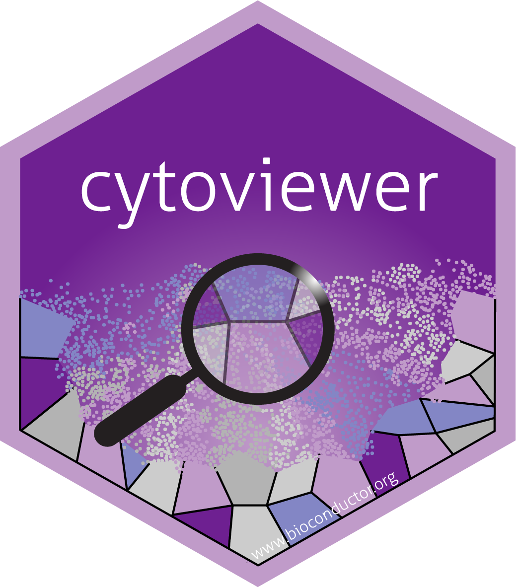
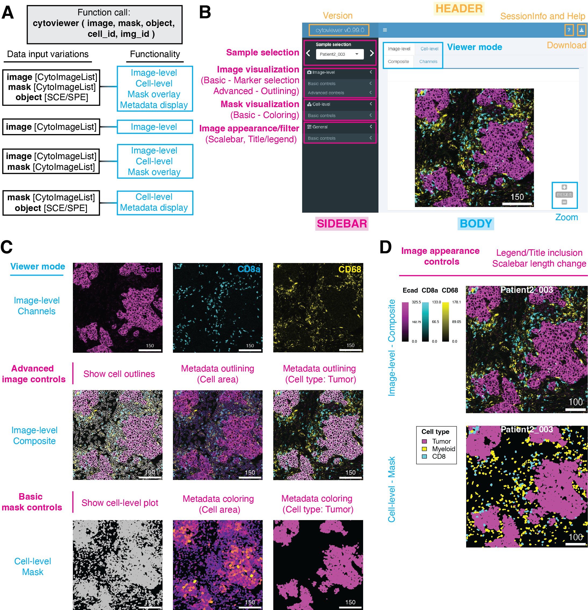

# cytoviewer

<!-- badges: start -->

[](https://github.com/BodenmillerGroup/cytoviewer/actions/workflows/docs.yml) [](https://app.codecov.io/gh/BodenmillerGroup/cytoviewer/tree/devel)

<!-- badges: end -->

An interactive multi-channel image viewer for R.

This shiny application allows users to interactively visualize multi-channel images and segmentation masks generated by imaging mass cytometry and other highly multiplexed imaging techniques. The `cytoviewer` package is divided into image-level (Composite and Channels) and cell-level visualization (Masks). It allows users to overlay individual images with segmentation masks, integrates well with [SingleCellExperiment](https://bioconductor.org/packages/release/bioc/html/SingleCellExperiment.html) / [SpatialExperiment](https://bioconductor.org/packages/release/bioc/html/SingleCellExperiment.html) and [CytoImageList](https://www.bioconductor.org/packages/release/bioc/html/cytomapper.html) objects for metadata and image visualization and supports image downloads.

Read the **BMC Bioinformatics paper** here: [doi.org/10.1186/s12859-023-05546-z](doi.org/10.1186/s12859-023-05546-z)

## Check status

| Bioc branch |                                                                                                                 Checks                                                                                                                 |
|:------------------------------------------:|:--------------------------:|
|   Release   | [](https://github.com/BodenmillerGroup/cytoviewer/actions/workflows/build-checks-release.yml) |
|    Devel    |    [](https://github.com/BodenmillerGroup/cytoviewer/actions/workflows/build-checks-devel.yml)    |

## Requirements

The `cytoviewer` package requires R version \>= 4.0. It builds on data objects and functions contained in the [cytomapper](https://bioconductor.org/packages/release/bioc/html/cytomapper.html) package.

## Installation

The `cytoviewer` package can be installed from `Bioconductor` via:

``` r
if (!requireNamespace("BiocManager", quietly = TRUE))
    install.packages("BiocManager")

BiocManager::install("cytoviewer")
```

The development version of `cytoviewer` can be installed from Github via:

``` r
if (!requireNamespace("remotes", quietly = TRUE))
    install.packages("remotes")

remotes::install_github("BodenmillerGroup/cytoviewer")
```

To load the package in your R session, type the following:

``` r
library(cytoviewer)
```

## Basic usage

``` r
library(cytoviewer)

# Load example datasets 
library(cytomapper)
data("pancreasImages")
data("pancreasMasks")
data("pancreasSCE")

# Use cytoviewer with images, masks and object
app <- cytoviewer(image = pancreasImages, 
                  mask = pancreasMasks, 
                  object = pancreasSCE, 
                  img_id = "ImageNb", 
                  cell_id = "CellNb")

if (interactive()) {
  
  shiny::runApp(app)

  }
```

For more detailed information on package usage and functionality, please refer to <https://bodenmillergroup.github.io/cytoviewer/>.

## Application overview



**(A)** The supported functionality (right) of *cytoviewer* depends on the data inputs (left). To match information between the objects, cell (cell_id) and image (img_id) identifiers can be provided. SCE/SPE = *SingleCellExperiment*/*SpatialExperiment*.

**(B)** The graphical user interface of *cytoviewer* is divided into a body, header, and sidebar. The body of *cytoviewer* includes the image viewer, which has three tabs: Composite (Image-level), Channels (Image-level), and Mask (Cell-level). Zooming is supported for Composite and Mask tabs. The package version, R session information, help page, and a drop-down menu for image downloads are located in the header. The sidebar menu has controls for sample selection, image visualization, mask visualization, and general settings. Scale bar: 150 µm

**(C)** *cytoviewer* supports different viewing modes. Top: The "channels" tab of image-level visualization displays individual channels. Shown are Ecad (magenta), CD8a (cyan), and CD68 (yellow) marking tumor cells, CD8+ T cells, and myeloid cells, respectively. Center: The "composite" tab of image-level visualization visualizes image composites combining multiple channels. These composite images can be overlayed with cell outlines, which can be colored by cell-specific metadata. Shown here are cell outlines colored by cell area (continous value) and cell type (categorical value; tumor cells in white). Channel color settings are as follows for all markers: Contrast: 2,5; Brightness: 1; Gamma: 1.2. Bottom: The "mask" tab can be used to visualize segmentation masks that can be colored by cell-specific metadata. Shown here are segmentation masks colored by cell area (continuous) and cell type (categorical; tumor cells in magenta). Scale bars: 150 µm.

**(D)** "Image appearance" controls can be used to add legends or titles and to change the scale bar length for image-level (top) and cell level (bottom) visualization. The cell-level mask plot depicts tumor (magenta), myeloid (yellow), and CD8+ T cells (cyan). Scale bars: 100 µm. 

**Adapted from Meyer et al., 2024**

## Contributing

For feature requests, please open an issue [here](https://github.com/BodenmillerGroup/cytoviewer/issues).

Alternatively, feel free to fork the repository, add your changes and issue a pull request.

## Citation

If you are using `cytoviewer` in your work, please cite the paper as:

```         
Meyer, L., Eling, N., & Bodenmiller, B. (2024). cytoviewer: an R/Bioconductor package for interactive visualization 
and exploration of highly multiplexed imaging data. BMC Bioinformatics, doi.org/10.1186/s12859-023-05546-z
```

## Authors

[Lasse Meyer](https://github.com/lassedochreden) lasse.meyer 'at' dqbm.uzh.ch

[Nils Eling](https://github.com/nilseling) nils.eling 'at' dqbm.uzh.ch
