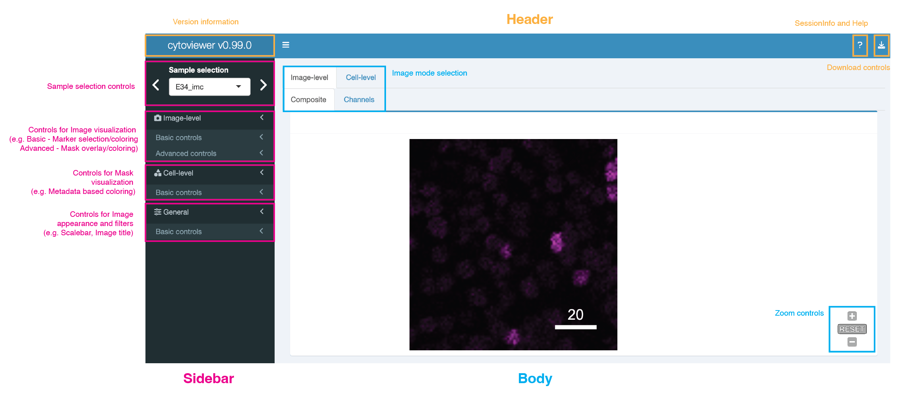

```{r, echo=FALSE, results="hide"}
knitr::opts_chunk$set(error=FALSE, warning=FALSE, message=FALSE,
                        fig.retina = 0.75, crop = NULL)
library(BiocStyle)
```

```{r library, echo=FALSE}
library(cytoviewer)
```

# Introduction

This vignette introduces the `cytoviewer` package for interactive
multi-channel image visualization. Images as well as corresponding
segmentation masks generated by imaging mass cytometry (IMC) and other
highly multiplexed imaging techniques can be interactively visualized
and explored.

The `cytoviewer` package builds on top of the `r Biocpkg("cytomapper")`
Bioconductor package and extends the static visualization strategies
provided by `cytomapper` via an **interactive Shiny application**. The
`cytoviewer` package leverages the image handling, analysis and
visualization strategies provided by the `r Biocpkg("EBImage")`
Bioconductor package and offers interactive image visualization
strategies in a similar fashion as `r Biocpkg("iSEE")` for single-cell
data. In addition, building up on `r Biocpkg("SingleCellExperiment")`,
`r Biocpkg("SpatialExperiment")` and `cytomapper::CytoImageList`
classes, the `cytoviewer` package integrates into the Bioconductor
framework for single-cell and image analysis.

## Highly multiplexed imaging

Highly multiplexed imaging allows simultaneous spatially and single-cell
resolved detection of dozens of biological molecules (e.g. proteins) in
their native tissue context. As a result, these technologies allow an
in-depth analysis of complex systems and diseases such as the tumor
microenvironment [@Jackson2020] and type 1 diabetes progression
[@Damond2019].

Imaging-based spatial proteomics methods [@Moffitt2022] can be broadly
divided into fluorescent cyclic approaches such as tissue-based cyclic
immunofluorescence (t-CyCIF) [@Lin2018] and one-step mass-tag based
approaches such as multiplexed ion beam imaging (MIBI) [@Angelo2014] and
IMC [@Giesen2014].

Of note, the instructions below will focus on the visualization and
exploration of **IMC data** as an example. However, data from other
technologies such as t-CyCIF or MIBI, which produce pixel-level
intensities and (optionally) segmentation masks, can be interactively
visualized with `cytoviewer` as long as they have the appropriate input
format (see Section [Data input format](#DataInputFormat)).

### Imaging mass cytometry

IMC, an advancement of CyTOF, combines antibodies tagged with
isotopically pure rare earth metals with laser ablation and
mass-spectrometry-based detection to produce high-dimensional images
[@Giesen2014]. It captures the spatial expression of over 40 proteins in
parallel at a sub-cellular resolution of 1 μm. Thus, IMC is able to
detect cytoplasmic and nuclear localization of proteins.

## Highly multiplexed image analysis

To fully leverage the information contained in IMC and multiplexed
imaging data in general, computational tools are of key importance.

The main analysis steps, irrespective of the biological question,
include 1) Visual inspection of images for quality control, 2) Image
pre-processing and segmentation and 3) Single-cell and spatial analysis
[@Windhager2021].

A comprehensive end-to-end workflow for multiplexed image processing and
analysis with detailed information for every analysis step can be found
[here](https://bodenmillergroup.github.io/IMCDataAnalysis/).

Importantly, the `cytoviewer` package can support, simplify and improve
any of these analysis steps with its easy-to-use interactive
visualization interface in R.

Below we will showcase an [example workflow](#ExampleWorkflow) that
highlights the different functionality and potential application fields
of `cytoviewer`.

## Application overview

The `cytoviewer` interface is broadly divided into
[image-level](#ImageLevel) (Composite and Channels) and
[cell-level](#CellLevel) visualization (Masks). It allows users to
overlay individual images with segmentation masks, integrates well with
`SingleCellExperiment` and `SpatialExperiment` objects for metadata
visualization and supports [image downloads](#Download).

### Data input format {#DataInputFormat}

The `cytoviewer` package combines objects of
`r Biocpkg("SingleCellExperiment")`, `r Biocpkg("SpatialExperiment")`
and `cytomapper::CytoImageList` classes (from `r Biocpkg("cytomapper")`)
to visualize image- and cell-level information.

The `cytoviewer` function takes up to **five arguments**.

Firstly, `image` refers to a `CytoImageList` object containing one or
multiple multi-channel images where each channel represents the
pixel-intensities of one marker (proteins in IMC).

Secondly, `mask` refers to a `CytoImageList` object containing one or
multiple segmentation masks. Segmentation masks are defined as
one-channel images containing integer values, which represent the cell
ids or background.

Thirdly, the `object` entry refers to a `SingleCellExperiment` or
`SpatialExperiment` class object that contains cell-specific metadata in
the `colData` slot.

Lastly, to match information between the `CytoImageList` objects and the
`SingleCellExperiment`/`SpatialExperiment` object, two additional spots
can be specified:

-   `img_id`: a single character indicating the `colData` (of the
    `SingleCellExperiment`/`SpatialExperiment` object) and
    `elementMetadata` (of the `CytoImageList` object) entry that
    contains the image identifiers. These image ids have to match
    between the `SingleCellExperiment`/ `SpatialExperiment` object and
    the `CytoImageList` objects.

-   `cell_id`: a single character indicating the `colData` entry that
    contains the cell identifiers. These should be integer values
    corresponding to pixel-values in the segmentation masks.

### Data input variations {#DataInputVariation}

The functionality of `cytoviewer` depends on which input objects are
user-provided. Below we describe the **four use cases** in respect to
input objects and functionality.

**1. Usage of cytoviewer with images, masks and object**

The *full* functionality of cytoviewer can be leveraged when `image`,
`mask` and `object` are provided, which is the main intended use case.

This allows [image-level](#ImageLevel) visualization (Composite and
Channels), [cell-level](#CellLevel) visualization, overlaying images
with segmentation masks as well as metadata visualization.

**2. Usage of cytoviewer with images only**

If only the `image` object is specified, [image-level](#ImageLevel)
visualization (Composite and Channels) is possible.

**3. Usage of cytoviewer with images and masks**

[Image-level](#ImageLevel) visualization (Composite and Channels),
overlaying of images with segmentation masks and
[cell-level](#CellLevel) visualization is feasible when `image` and
`mask` objects are provided.

**4. Usage of cytoviewer with masks and object**

If `mask` and `object` are specified, [cell-level](#CellLevel)
visualization as well as metadata visualization is possible.

# Example workflow {#ExampleWorkflow}

## Installation

The `cytoviewer` package can be installed from `Bioconductor` via:

```{r bioc-install, eval=FALSE}
if (!requireNamespace("BiocManager", quietly = TRUE))
    install.packages("BiocManager")

BiocManager::install("cytoviewer")
```

The development version of `cytoviewer` can be installed from Github
via:

```{r devel-install, eval=FALSE}
if (!requireNamespace("remotes", quietly = TRUE))
    install.packages("remotes")

remotes::install_github("BodenmillerGroup/cytoviewer")
```

To load the package in your R session, type the following:

```{r load}
library(cytoviewer)
```

## Example dataset

For visualization purposes, we will use a toy dataset provided by the
`r Biocpkg("cytomapper")` package.

The dataset contains 3 images of $100\mu{m}$ x $100\mu{m}$ dimensions
with 362 segmented cells and pixel-intensities for 5 proteins: H3, CD99,
PIN, CD8a, and CDH. It is a small subset from a Type 1 Diabetes dataset
[@Damond2019].

Pixel-level intensities for all 5 markers (5 channels) are stored in the
`pancreasImages` object.

The corresponding segmentation masks are stored in the `pancreasMasks`
object.

All cell-specific metadata are stored in the `colData` slot of the
corresponding `SingleCellExperiment` object: `pancreasSCE`.

For more detailed information on the dataset, please refer to the
respective documentation (e.g. via `?pancreasImages` or the vignette of
the `r Biocpkg("cytomapper")` package).

```{r dataset}
# Load example datasets 
library(cytomapper)
data("pancreasImages")
data("pancreasMasks")
data("pancreasSCE")

pancreasImages
pancreasMasks 
pancreasSCE
```

## Function call

Here as an example, we call `cytoviewer` with `image`, `mask` and
`object` data to leverage all provided functionality.

This setting allows [image-level](#ImageLevel) visualization (Composite
and Channels), [cell-level](#CellLevel) visualization, overlaying images
with segmentation masks as well as metadata visualization.

For further details, please refer to the `?cytoviewer` manual or the
`Help page` within the shiny application.

```{r cytoviewer}
# Use cytoviewer with images, masks and object
app <- cytoviewer(image = pancreasImages, 
                  mask = pancreasMasks, 
                  object = pancreasSCE, 
                  img_id = "ImageNb", 
                  cell_id = "CellNb")

if (interactive()) {
  
  shiny::runApp(app, launch.browser = TRUE)

  }
```

## Interface {#Interface}

The `cytoviewer` interface is divided into a **Header**, **Sidebar** and
**Body** section (see Figure below).

The **Header** includes package version information, access to session
information and the help page as well as a dropdown-menu for [image
downloads](#Download).

The **Body** features a Tabset-Panel layout allowing the user to switch between
three image modes: [Image-level](#ImageLevel) (Composite and Channels)
and [Cell-level](#CellLevel) (Mask). Furthermore, the Composite and Mask
tabs have zoom controls.

The **Sidebar** panel is subdivided into four sections: *Sample selection*, 
*Image-level*, *Cell-level* and [*General*](#General)
controls.



## Image-level visualization {#ImageLevel}

Image visualization control is split into *basic* and *advanced controls*.

*Basic controls* supports the selection of up to six markers/channels
for `image` display. Each marker has color control settings that allow
the user to set contrast, brightness, gamma and select a channel color.

In the *advanced controls* part, the user can choose to overlay the
displayed images with provided segmentation `masks`. Outline color and
mask thickness can be adjusted by the user. Moreover, the masks can be
outlined by cell-specific metadata provided in `colData` slot of the
`object`.

Of note, for categorical and continuous metadata entries the user can
choose between discrete colors and continuous color palettes (viridis,
inferno, plasma), respectively.

## Cell-level visualization {#CellLevel}

Cell visualization has *basic controls*.

Here, the user can choose to display the provided segmentation `masks`.
If an `object` is provided, the masks can be colored by cell-specific
metadata.

Please note again that for categorical and continuous metadata entries
the user can choose between discrete colors and continuous color
palettes (viridis, inferno, plasma), respectively.

## General controls {#General}

General controls is subdivided into an *Image appearance* and 
*Image filters* part.

In the *Image appearance* section, the user can adjust the scale bar
length and include legend/image titles, while the *Image filters*
section allows to control pixel-wise interpolation (default) and apply a
Gaussian filter.

## Image download {#Download}

The `cytoviewer` package supports fast and uncomplicated image
downloads.

Download controls are part of the **Header** (see Section
[Interface](#Interface)).

The user can specify a file name, select the image of interest
(Composite, Channels, Mask) and the file format (pdf, png). Upon
clicking the download button, a pop-window should appear where the user
can specify the download location.

# Session info {.unnumbered}

```{r sessionInfo, echo=FALSE}
sessionInfo()
```

# References
